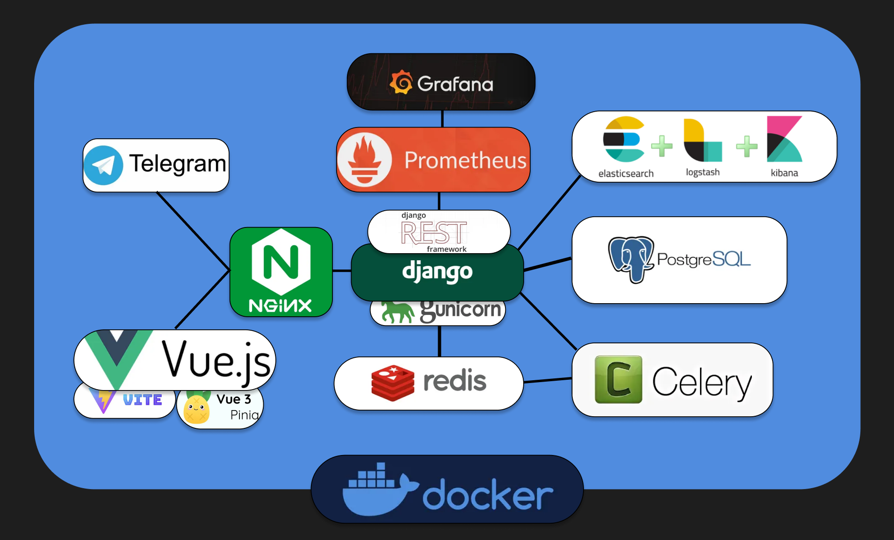

Данный проект был создан для демонстрации полноценного fullstack приложения, созданного на базе Django Rest Framework, включая CRUD-операции, аутентификацию, маршрутизацию, Redis кэширование, отправку email уведомлений при помощи Celery и многое другое.

# Запуск через Docker Compose

```bash
docker compose build
docker compose up -d
```

Перед запуском переименуйте .env.example в .env и измените значения

- Важно: телеграм бот не будет работать без корректного токена

# API Документация

Проект предоставляет документацию по API с помощью Swagger. Чтобы получить доступ к документации по API, выполните следующие действия:

Убедитесь, что проект запущен, откройте веб-браузер и перейдите к следующей конечной точке:

```bash
/swagger
```

OpenAPI v3 генерируется с помощью drf-spectacular. Файл распологается на конечной точке:

```bash
/schema
```

Для генерации клиентских библиотек используйте команды:

```bash
docker run --rm -v "${PWD}:/app" openapitools/openapi-generator-cli:v7.7.0 generate -i /app/BlogAPI.yaml -g python -o /app/telegrambot/blogapi

docker run --rm -v "${PWD}:/app" node:alpine npx swagger-typescript-api -p /app/BlogAPI.yaml -n api.ts -o /app/frontend/src/services
```

В проекте представлено 2 клиента для взаимодействия:

1. Классический web frontend на Vue.js
2. Телеграм бот

Библиотеки для клиентских приложений генерируются на основе файла схемы.

E-mail сообщения о верификации представлены в виде файлов в docker volume.

# Дефолтный пользователь:

- email: admin@admin.com
- password: admin

# Для быстрого наполнения БД используйте команду:

```bash
python manage.py populate_db [--articles ARTICLES] [--users USERS] [--tags TAGS] [--comments COMMENTS]
```

# Архитектура проекта



# Оптимизация

- Оптимизация ORM запросов
- Кэширование через Redis
- Отложенные задачи через Celery
- Быстрый поиск с ElasticSearch
- Сбор логов в ElasticSearch через Logstash

# Мониторинг и управление

- Админка Django: /admin
- Мониторинг метрик сервера: /grafana
- Мониторинг документов ElasticSearch: /kibana
- Монитроинг задач Celery: /flower
- Swagger OpenApi: /swagger
- Нагрузочное тестирование: /locust

# Online Demo

- [Сайт](https://timeweb.com/frontend/)
- [Телеграм бот](https://t.me/DemoBlogByTomashinMbot)
